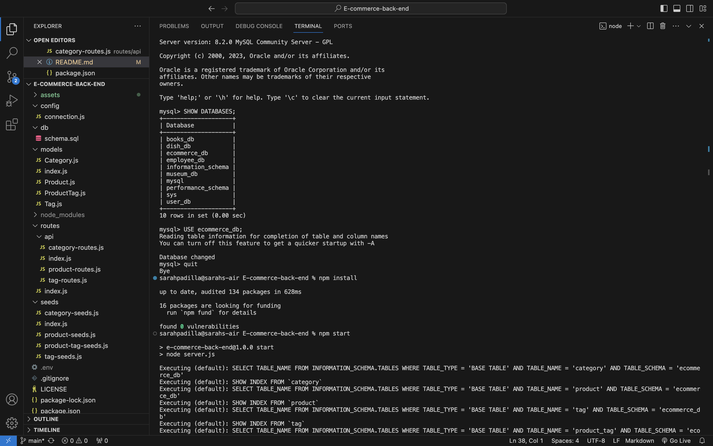

# E-commerce-back-end

## Description

Internet retail, also known as e-commerce, plays a significant role within the electronics industry, as it empowers businesses and consumers alike to conveniently engage in online buying and selling of electronic products. E-commerce platforms like Shopify and WooCommerce provide a suite of services to businesses of all sizes. Due to the prevalence of these platforms, delevopers should understand the fundamental architecture of e-commerce sites. The challenge is to build the back end for an e-commerce site by using a working Express.js API and configure it to use Sequelize to interact with a MySQL database.

## User Story

As a manager at an internet retail company, I want a back end for my e-commerce website that uses the latest technologies so that my company can compete with other e-commerce companies.

## Acceptance Criteria

 - Given a functional Express.js API
 - When I add my database name, MySQL username, and MySQL password to an environment variable file
 - Then I am able to connect to a database use Sequelize
 - When I enter chema and seed commands
 - Then a development database is created and is seeded with test data
 - When I enter the command to invoke the application
 - Then my server is started and the Sequelize models are synced to the MySQL database
 - When I open API GET routes in Insomnia Core for categories, products, or tags
 - Then the data for each of these routes is displayed in a formatted JSON
 - When I test API POST, PUT, and DELETE routes in Insomnia Core
 - Then I am able to successfully create, update, and delete data in my database

## Installation

 - To install Node, type 'npm init' in terminal.
 - To install Express, type 'npm i express@4.17.1' in terminal.
 - To install MySQL2, type 'npm i mysql2' in terminal.
 - To install Sequelize, type 'npm i sequelize' in terminal.
 - To install dotenv package, type 'npm i dotenv' in terminal.

## Images

### Terminal

### All Products Example - GET

### Product ID Example - GET

### Product Create Example - POST

### Product Update Example - PUT

### Product Delete Example - DELETE

## Link to Video Walkthrough

**Video:** [Link](https://www.youtube.com/watch?v=TzrPHI3d-XU)

## Credits

The starter code for the config, models, routes, seeds, and server.js files for this project was used from a repository named "fantastic-umbrella" located in the Develop folder which can be accessed through the following link: https://github.com/coding-boot-camp/fantastic-umbrella.git

Stack Overflow

## License

